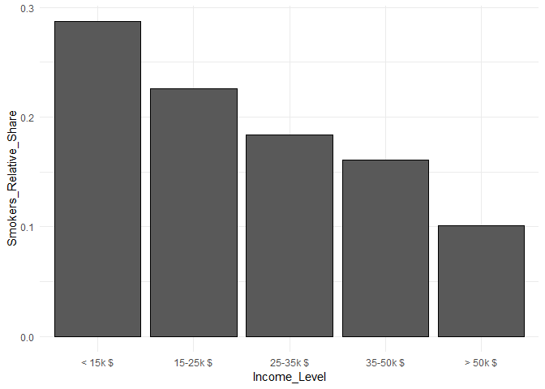
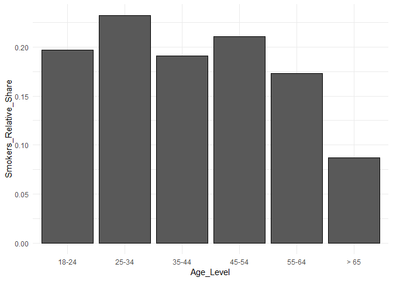

Exploring the BRFSS data
================

 

------------------------------------------------------------------------

 

Setup
-----

 

### Load packages

``` r
library(ggplot2)
library(dplyr)
```

### Load data

``` r
load("brfss2013.RData")
```

 

------------------------------------------------------------------------

 

Part 1: Data
------------

 

The BRFSS survey covers all 50 US states, D.C. and three other US teritories. Regarding the geography at the state level,people across USA are sampled randomly because basically all teritories are covered in the survey. The collected data is weighted for each state, so that it proplerly represents the share in the US population. Therefore, results from the analysis can be generalized to the whole US population.

The survey respondents are people with 18+ age. Therefore, the results of the survey/analysis can be generalized only to the segment of population which is equal and above 18 years of age. Parts of the survey which are aimed to the population below 18 years of age, can be generalized to the same segment of the population.

The survey is conducted over land phones and cellular phones. This means that people without access to these means of communication (also people who do not own a phone) are not covered in this survey. This means that the survey is biased, because only people with a phone participate in the survey. A generalization of an analysis result cannot be made to the whole population. However, as ~97% of the population has access to a phone (either land or cellular), a generalization of a result can be made for the major part (97%) of the population. This is probably a well enough indicator/proxy for the whole (100%) population.

Each state has the option to choose way of sampling the survey respondents (phone numbers to call). For landline numbers, 48/53 states use disproportionate stratified sampling for the sub-state regions (geographical units below state-level). 5 other units use simple random sampling. For cellular numbers, 51/53 states/teritories use use disproportionate stratified sampling for the sub-state regions, in relation to the 2 teritories which use simple random sampling. There are various reasons for disproportionate stratified sampling - one of them is a disproportionate population size across sub-regions.

Even though they are standardized, optional modules in the survey are chosen by a particular state with the free will. Therefore, results of the survey/analysis of optional modules cannot be generalized to the whole population, except for a module which was chosen by each and every state.

As this analysis is an observational study and not an experiment, nothing can be really said about causality/random assignment. Random assignment is a prerequisite step done only in an experiment. Therefore, when discussing the results of the analysis made in this report, no conclusions about the causality (e.g. one thing is causing the other) can be made.

 

------------------------------------------------------------------------

 

Part 2: Research questions
--------------------------

 

#### **Research question 1**

 

The goal of Question 1 is to examine if there is a connection between smoking habit and some of the socio-economic parameters of US population.

 

Some particular questions:

-   Is smoking conncected to income and/or age?

-   Does the relative number of smokers differ across different income levels and/or different age levels?

 

#### **Research question 2**

 

The goal of Question 2 is to examine if there is a connection between education level and particular habits/behaviour among the US population.

 

Some particular questions:

-   Does the level of education influence the habit of wearing a seatbelt?

-   Does the level of education influence sleep time?

-   Does the level of education influence alcohol consumption?

 

#### **Research question 3**

 

The goal of Question 3 is to examine if how depression influences weight, sleep time and marital status.

 

Some particular questions:

-   Is weight of people influenced by depression experience?

-   Is sleep time influenced by depression experience?

-   Is marital status influenced by depression experience?

 

------------------------------------------------------------------------

 

Part 3: Exploratory data analysis
---------------------------------

 

### Analysis for the Research question 1

 

#### 1.1. Testing for Income

 

The percentage of **smokers** for each **income** level:

``` r
# Calculating the percentage of smokers for each Income level
Smokers_Income <- brfss2013 %>%
    filter ( !is.na(X_rfsmok3) , !is.na(X_incomg) ) %>% 
    group_by (Income = X_incomg) %>%
    summarise (Smokers_Relative_Share = sum(X_rfsmok3 == "Yes") / n())

# Displaying the percentages
Smokers_Income
```

    ## # A tibble: 5 x 2
    ##   Income                       Smokers_Relative_Share
    ##   <fct>                                         <dbl>
    ## 1 Less than $15,000                             0.287
    ## 2 $15,000 to less than $25,000                  0.226
    ## 3 $25,000 to less than $35,000                  0.184
    ## 4 $35,000 to less than $50,000                  0.160
    ## 5 $50,000 or more                               0.101

It can be seen that the relative number of **smokers** indeed differes across different **income** levels.

 

 

 

Renaming **income** levels in the summary file and creating an X-axis rank vector for plotting, with ascendingly ordered **income** values (to avoid automatic alphabetical ordering on x-axis):

``` r
# Replacing long names of Income levels with shorter names in the summarised file
Smokers_Income$Income <- c("< 15k $", "15-25k $", "25-35k $", "35-50k $", "> 50k $")

# Displaying the modified "Smokers_Income" dataframe
Smokers_Income
```

    ## # A tibble: 5 x 2
    ##   Income   Smokers_Relative_Share
    ##   <chr>                     <dbl>
    ## 1 < 15k $                   0.287
    ## 2 15-25k $                  0.226
    ## 3 25-35k $                  0.184
    ## 4 35-50k $                  0.160
    ## 5 > 50k $                   0.101

``` r
# Creating a rank vector of Income levels, used for plotting to avoid alphabetical ordering in a chart
Income_Level <- factor(Smokers_Income$Income, 
                       level = c("< 15k $", "15-25k $", "25-35k $", "35-50k $", "> 50k $" ))

# Displaying the rank vector
Income_Level
```

    ## [1] < 15k $  15-25k $ 25-35k $ 35-50k $ > 50k $ 
    ## Levels: < 15k $ 15-25k $ 25-35k $ 35-50k $ > 50k $

In this step, the long names for **income** levels are substituted with shorter ones that are easier to read. This change is made only in the newly created dataset "Smokers\_Income". With the second command block, a vector with ascendingly sorted **income** levels is created and it will be usef for plotting, as the R would plot the **income** levels in alphabetical order.

 

 

 

Bar chart showing percentage of **smokers** across **income** levels (the numerical result shown just above):

``` r
ggplot (Smokers_Income, aes(x = Income_Level, y = Smokers_Relative_Share)) + geom_col(color = "black") +
    theme_minimal()
```



 

The column chart clearly shows that there is less **smokers** in the higher **income** grade/level. The highest relative number of **smokers** is in the "&lt;15 k" **income** level, and it gradually decreases all over to the highest **income** level "&gt;50 k".

 

 

 

#### 1.2. Testing for Age

 

The percentage of smokers for each **age** level:

``` r
# Calculating the percentage of smokers for each Age level
Smokers_Age <- brfss2013 %>%
  filter ( !is.na(X_rfsmok3), !is.na(X_age_g) ) %>%
  group_by (Age = X_age_g ) %>%
  summarise (Smokers_Relative_Share = sum(X_rfsmok3 == "Yes") / n())

# Displaying the percentages
Smokers_Age
```

    ## # A tibble: 6 x 2
    ##   Age             Smokers_Relative_Share
    ##   <fct>                            <dbl>
    ## 1 Age 18 to 24                    0.197 
    ## 2 Age 25 to 34                    0.232 
    ## 3 Age 35 to 44                    0.191 
    ## 4 Age 45 to 54                    0.211 
    ## 5 Age 55 to 64                    0.173 
    ## 6 Age 65 or older                 0.0872

It is not so clear if there is a difference in relative number of **smokers** across **age** levels.

 

 

 

Again, renaming **age** levels in the summary file and creating an X-axis rank vector for plotting, with ascendingly ordered **age** values (to avoid automatic alphabetical ordering on x-axis):

``` r
# Replacing long names of Age levels with shorter
Smokers_Age$Age <- c("18-24", "25-34", "35-44", "45-54", "55-64", "> 65")

# Displaying the modified "Smokers_Age" dataframe
Smokers_Age
```

    ## # A tibble: 6 x 2
    ##   Age   Smokers_Relative_Share
    ##   <chr>                  <dbl>
    ## 1 18-24                 0.197 
    ## 2 25-34                 0.232 
    ## 3 35-44                 0.191 
    ## 4 45-54                 0.211 
    ## 5 55-64                 0.173 
    ## 6 > 65                  0.0872

``` r
# Creating a rank vector of Age levels, used for plotting to avoid alphabetical ordering
Age_Level <- factor(Smokers_Age$Age, level = c("18-24", "25-34", "35-44", "45-54", "55-64", "> 65"))

# Displaying the rank vector
Age_Level
```

    ## [1] 18-24 25-34 35-44 45-54 55-64 > 65 
    ## Levels: 18-24 25-34 35-44 45-54 55-64 > 65

In this step, the long names for **age** levels are substituted with shorter ones that are easier to read. This change is made only in the newly created dataset "Age\_Level". With the second command, a vector with ascendingly sorted **age** levels is created, as the R would plot the income levels in alphabetical order.

 

 

 

Bar chart showing percentage of **smokers** across **age** levels (the numerical result shown just above):

``` r
ggplot (Smokers_Age, aes(x = Age_Level, y = Smokers_Relative_Share)) + 
    geom_col(color = "black") + 
    theme_minimal()
```



 

From the chart, it is hard to see any particular trend of relative number of smokers across age levels. The only notable differences are for the **age** level "&lt;65" (much lower relative number of smokers than the rest) and **age** level "25-34" (slightly higher than the rest).

 

------------------------------------------------------------------------

 

### Conclusion on Research Question 1

 

It can be concluded that **smoking** is indeed dependent on **income** or in other words - quality of life. As one's **income** increases, it is likely that he/she will quit **smoking** or never even start **smoking**.

On the other side, **smoking** is not dependent on **age**, even though there is a notable difference for some **age** levels in terms of relative number of smokers (e.g. in the segment: "&gt; 65" there are less smokers in relative terms).

 

------------------------------------------------------------------------

 

### Analysis for the Research question 2

 

Relative number of people who **wear a seatbelt** across **education** levels:

``` r
# Percentage of people who (always and almost always) wear a seatbelt across education levels of people
brfss2013 %>%
  filter ( !is.na(X_educag) , !is.na(seatbelt) ) %>% 
  group_by (Education = X_educag) %>%
  summarise (Wearing_Seatbelt = sum(seatbelt == "Always", seatbelt == "Nearly always") / n())
```

    ## # A tibble: 4 x 2
    ##   Education                                  Wearing_Seatbelt
    ##   <fct>                                                 <dbl>
    ## 1 Did not graduate high school                          0.894
    ## 2 Graduated high school                                 0.917
    ## 3 Attended college or technical school                  0.939
    ## 4 Graduated from college or technical school            0.966

It can be seen that within segments of people with higher levels of **education**, more people **wear a seatbelt**.

 

 

Average (mean) **sleep time** across **education** levels:

``` r
# Average sleep time (in hours) across different education levels of people
brfss2013 %>%
  filter ( !is.na(X_educag) , !is.na(sleptim1) ) %>% 
  group_by (Education = X_educag) %>%
  summarise (Sleep_Time_Average = mean(sleptim1))
```

    ## # A tibble: 4 x 2
    ##   Education                                  Sleep_Time_Average
    ##   <fct>                                                   <dbl>
    ## 1 Did not graduate high school                             7.02
    ## 2 Graduated high school                                    7.05
    ## 3 Attended college or technical school                     6.99
    ## 4 Graduated from college or technical school               7.10

With the **sleep time**, it is hard to see a clear trend across different **education** levels. The mean is the same for the first two **education** levels, it is lower for the third than it was for the first two, and the highest (above all) for the fourth.

 

 

**Alcohol consumption** (drinks per day) across **education** levels:

``` r
# Average number of alcohol drinks per day (in the last month) across different education levels of people
brfss2013 %>%
  filter ( !is.na(X_educag) , !is.na(avedrnk2) ) %>% 
  group_by (Education = X_educag) %>%
  summarise (Drinks_Average = mean(avedrnk2))
```

    ## # A tibble: 4 x 2
    ##   Education                                  Drinks_Average
    ##   <fct>                                               <dbl>
    ## 1 Did not graduate high school                         3.32
    ## 2 Graduated high school                                2.55
    ## 3 Attended college or technical school                 2.28
    ## 4 Graduated from college or technical school           1.88

Here, a clear trend of **alcohol consumption** across **education** levels can be observed. The mean of **monthly number of drinks** is the highest for the segment with lowest **education**, and it gradually decreases all the way to the last segment (college/university degree).

 

------------------------------------------------------------------------

 

### Conclusion on Research Question 2

 

A conclusion can be made that **wearing a seatbelt** and **alcohol consumption** is dependent on **education**, while **sleeping time** is not.

However, the **education** itself is probably not the only factor which determines **wearing a seatbelt** or **alcohol consumption** but a good proxy for other influencing variables (factors) such as: income, habits/lifestyle etc.

 

------------------------------------------------------------------------

 

### Analysis for the Research question 3

 

Converting variable **weight** from categorical (factor) type to numeric:

``` r
# Type of variable "weight2"
str(brfss2013$weight2)
```

    ##  Factor w/ 570 levels "",".b","100",..: 154 30 63 31 169 128 9 1 139 73 ...

``` r
# Converting variable "weight2" of factor type to numeric type
brfss2013 <- brfss2013 %>%
  mutate (weight_numeric = as.numeric(as.character(brfss2013$weight2)))
```

    ## Warning in evalq(as.numeric(as.character(brfss2013$weight2)),
    ## <environment>): NAs introduced by coercion

``` r
# Type of newly created variable "weight_numeric"
str(brfss2013$weight_numeric)
```

    ##  num [1:491775] 250 127 160 128 265 225 106 NA 235 170 ...

 

 

Average **weight** of people who experienced **depression** in comparison to people who did not:

``` r
# Calculating average weight for people who experienced depression vs. those who did not
brfss2013 %>%
  filter ( !is.na(addepev2) , !is.na(weight_numeric) ) %>% 
  group_by (Had_depression = addepev2) %>%
  summarise (Average_weight = mean(weight_numeric), Median = median(weight_numeric), 
             Std_dev = sd(weight_numeric))
```

    ## # A tibble: 2 x 4
    ##   Had_depression Average_weight Median Std_dev
    ##   <fct>                   <dbl>  <dbl>   <dbl>
    ## 1 Yes                      191.    175    294.
    ## 2 No                       194.    170    413.

There is almost no difference in the means of **weight** (195 vs 194). The median of **weight** is higher for the segment of people who experienced a **depression**, but that segment also has a lower standard deviation. It is hard to make a conclusion on some kind of dependency based on the results.

 

 

Average **sleep time** of people who experienced **depression** in comparison to people who did not:

``` r
# Calculating sleep time for people who experienced depression vs those who did not
brfss2013 %>%
  filter ( !is.na(addepev2) , !is.na(sleptim1) ) %>% 
  group_by (Had_depression = addepev2) %>%
  summarise (Average_sleep = mean(sleptim1), Median = median(sleptim1), 
             Std_dev = sd(sleptim1))
```

    ## # A tibble: 2 x 4
    ##   Had_depression Average_sleep Median Std_dev
    ##   <fct>                  <dbl>  <dbl>   <dbl>
    ## 1 Yes                     6.88      7    1.87
    ## 2 No                      7.09      7    1.35

There is a clear sign that, on average, people who experienced **depression** **sleep less** than people who did not. Same segment of people (those who did experience **depression**) also has a much higher standard deviation for **sleep time**.

 

 

 

Share of **divorced people** among those that have experienced **depression** in comparison to those that **have not experienced depression**:

``` r
# Calculating marital status (divorce in particular) for people who experienced depression vs those who did not
brfss2013 %>%
  filter ( !is.na(addepev2) , !is.na(marital) ) %>% 
  group_by (Had_depression = addepev2) %>%
  summarise (Divorced = sum(marital == "Divorced")/n())
```

    ## # A tibble: 2 x 2
    ##   Had_depression Divorced
    ##   <fct>             <dbl>
    ## 1 Yes               0.216
    ## 2 No                0.126

It is clear that in the segment of people that have experienced **depression**, there is a much higher share (relative number) of those that are **divorced** (21.4%) compared to the segment of people that have not experienced **depression** (12.5%). One has to be careful here about causality (as well as with any of the results above). It could be that the **depression** is not the cause for **divorce**, but vice versa - the **divorce** can be a cause of **depression**. However, it is interesting to see the difference in **marital status** (share of **divorced** people) between these two segments.

 

------------------------------------------------------------------------

 

### Conclusion on Research Question 3

 

It can be concluded that, on average, there is no difference in **weight** between the people who experienced **depression** and those who did not.

On the other hand, there is difference in **sleeping time** (people who experienced **depression sleep less**, on average) and **divorce** rate (share of **divorced** people is almost two times higher within the segment of people who experinced **depression**). However, one has to be careful as the **divorce** is not neccessarily caused by **depression**; it could be the other way around - **divorce** could be one of the causes for **depression**.

 

------------------------------------------------------------------------

------------------------------------------------------------------------
