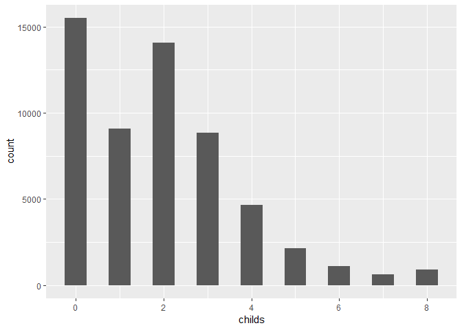
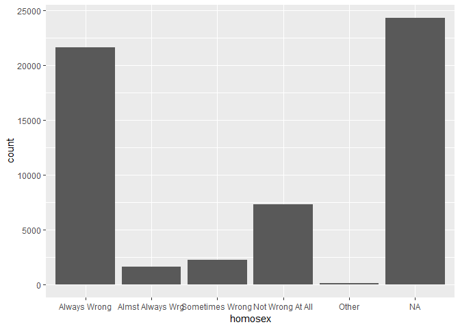
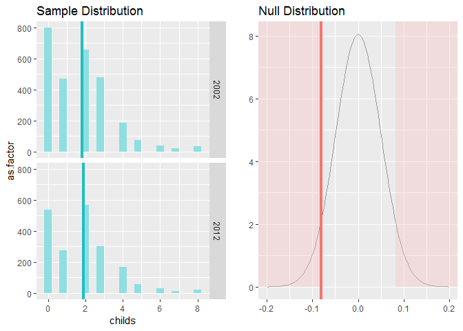
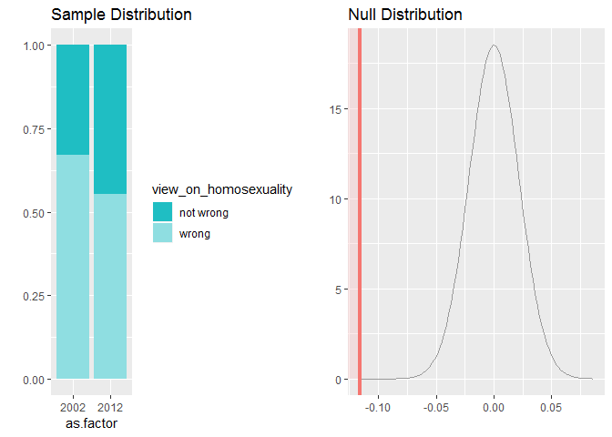
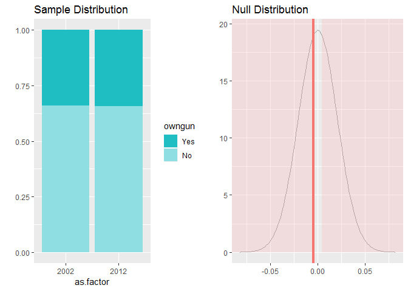

Statistical inference with the GSS data
================

 

------------------------------------------------------------------------

 

Setup
-----

 

### Load packages

``` r
library(ggplot2)
library(dplyr)
library(statsr)
```

 

### Load data

``` r
load("gss.Rdata")
```

 

------------------------------------------------------------------------

 

Part 1: Data
------------

 

The General Social Survey (GSS) monitors the changes happening in the US society. The survey is conducted by a respectible US institution and it uses random sampling as a selection methodology. Also, only one person per household is interviewed to avoid any kind of bias in the data. Therefore, the results of the General Social Survey (GSS) analysis can be generalized to the whole US population.

As this analysis is an observational study and not an experiment, nothing can be really said about causality/random assignment. Random assignment is a prerequisite step done only in an experiment. Therefore, when discussing the results of the analysis made in this report, no conclusions about the causality (e.g. one thing is causing the other) can be made.

 

------------------------------------------------------------------------

 

Part 2: Research questions
--------------------------

 

#### **Research question 1**

The goal of the Research question 1 is to explore is there a difference in the **mean number of children per family**, between 2002 and 2012 (10 year period).

 

#### **Research question 2**

The goal of the Research question 2 is to explore if the proportion of people who think that **homosexuality is NOT wrong**, increased from 2002 to 2012.

 

#### **Research question 3**

The goal of the Research question 3 is to explore if the proportion of people who **own a gun**, changed from 2002 to 2012.

 

------------------------------------------------------------------------

 

Part 3: Exploratory data analysis
---------------------------------

 

Checking all the years (after 1990) when the survey was conducted, and the number of respondents for each year:

``` r
gss %>%
  filter (year > 1990) %>%
  group_by (year) %>%
  summarise (n())
```

    ## # A tibble: 12 x 2
    ##     year `n()`
    ##    <int> <int>
    ##  1  1991  1517
    ##  2  1993  1606
    ##  3  1994  2992
    ##  4  1996  2904
    ##  5  1998  2832
    ##  6  2000  2817
    ##  7  2002  2765
    ##  8  2004  2812
    ##  9  2006  4510
    ## 10  2008  2023
    ## 11  2010  2044
    ## 12  2012  1974

The results shows that from 1994 onwards, the survey was conducted **every second year**. Majority of those surveys had **over 2000 respondents**.

 

------------------------------------------------------------------------

 

### **Exploratory data analysis for the Research question 1**

 

In order to conduct hypothesis test, a new b

Checking the variable type:

``` r
str(gss$childs)
```

    ##  int [1:57061] 0 5 4 0 2 0 2 0 2 4 ...

It is clear from the output that the variable type is **integer** (numerical).

 

 

Checking the range of the variable, to inspect for existance of outliers:

``` r
range (gss$childs, na.rm = TRUE)
```

    ## [1] 0 8

It is reasonable to conclude that there are **no outlier values** for this variable.

 

 

The distribution of the variable **childs** (number of children in family) is shown in the following chart:

``` r
ggplot(data = gss, aes(x = childs)) + geom_histogram(binwidth = 0.5, na.rm = TRUE)
```



The distribution is multimodal, with two peeks surely beeing **zero** and **two** (number of children in family).

 

------------------------------------------------------------------------

 

### **Exploratory data analysis for the Research question 2**

 

Checking the variable type:

``` r
str(str(gss$homosex))
```

    ##  Factor w/ 5 levels "Always Wrong",..: NA NA NA NA NA NA NA NA NA NA ...
    ##  NULL

This variable is categorical, with **five levels** (categories).

 

 

List of all levels for this variable:

``` r
gss %>%
  group_by (homosex) %>%
  summarise (n())
```

    ## # A tibble: 6 x 2
    ##   homosex          `n()`
    ##   <fct>            <int>
    ## 1 Always Wrong     21601
    ## 2 Almst Always Wrg  1581
    ## 3 Sometimes Wrong   2243
    ## 4 Not Wrong At All  7282
    ## 5 Other               82
    ## 6 <NA>             24272

We see a clear list of all levels, and corresponding number of respondents. A command ***"levels"*** would also list all the leves, but without the corresponding number of entries for each level.

 

 

Distribution of the variable **homosex** (view on homosexuality):

``` r
ggplot (data = gss, aes(x = homosex)) + geom_bar()
```



It can be seen from the plot that there are many missing values (NA), but from those respondents that answered, the **"always wrong"** view on the homosexuality is strongly dominating.

 

------------------------------------------------------------------------

 

### **Exploratory data analysis for the Research question 3**

 

Checking the variable type:

``` r
str(str(gss$owngun))
```

    ##  Factor w/ 3 levels "Yes","No","Refused": NA NA NA NA NA NA NA NA NA NA ...
    ##  NULL

This variable is categorical, with **three levels** (categories). The last one is **"refused"** which is not really a level and can be considered similarly to a missing value.

 

 

List of all levels for this variable:

``` r
gss %>%
  group_by (owngun) %>%
  summarise (n())
```

    ## # A tibble: 4 x 2
    ##   owngun  `n()`
    ##   <fct>   <int>
    ## 1 Yes     14000
    ## 2 No      20144
    ## 3 Refused   315
    ## 4 <NA>    22602

We see a clear list of all levels, and corresponding number of respondents. It is basically a binary variable: **yes** (own a gun) or **no** (doesn't own a gun).

 

 

------------------------------------------------------------------------

 

Part 4: Inference
-----------------

 

### **Hypothesis for the Research question 1**

 

The goal here is to check for the selected time period (from 2002 to 2012), whether the mean *number of children per family*:

-   **stayed the same** (the null hypothesis or **H0**) or

-   **changed** (the alternate hypothesis or **H1**) .

 

**H0:** mu\_2002 = mu\_2012

**H1:** mu\_2002 != mu\_2012

 

### **Inference for the Research question 1**

 

Creating a new dataset from the original dataset, by just selecting variables: **year** and **childs**:

``` r
# Creating the new dataset
Number_of_children <- gss %>%
  filter( !is.na(childs), year == 2002 | year == 2012  ) %>%
  select(year, childs)

# Checking the structure of the new dataset
str (Number_of_children)
```

    ## 'data.frame':    4731 obs. of  2 variables:
    ##  $ year  : int  2002 2002 2002 2002 2002 2002 2002 2002 2002 2002 ...
    ##  $ childs: int  0 1 1 1 2 1 2 2 2 0 ...

It is clear from the output, that the new dataset **"Number\_of\_children"** contains only variables **year** and **childs**.

 

 

Hypothesis testing for the difference of two independent means (mu\_2002 and mu\_2012):

``` r
inference(y = childs, x = as.factor(year), data = Number_of_children, statistic = "mean", 
          type = "ht", null = 0, method = "theoretical", alternative = "twosided")
```

    ## Response variable: numerical
    ## Explanatory variable: categorical (2 levels) 
    ## n_2002 = 2760, y_bar_2002 = 1.8105, s_2002 = 1.6876
    ## n_2012 = 1971, y_bar_2012 = 1.8919, s_2012 = 1.6745
    ## H0: mu_2002 =  mu_2012
    ## HA: mu_2002 != mu_2012
    ## t = -1.6435, df = 1970
    ## p_value = 0.1004



 

------------------------------------------------------------------------

 

The data **does NOT provide** a convincing evidence that the mean **mu\_2002** (1.81) is different from the mean **mu\_2012** (1.89), as the p-value is **p = 0.1** (it is greater than the significance level **alpha = 0.05**).

Therefore, we **cannot** claim that there is a difference in the average number of children per family, between 2002 and 2012.

 

------------------------------------------------------------------------

 

### **Hypothesis for the Research question 2**

 

The goal here is to check for the selected time period (from 2002 to 2012), whether the proportion of people who think that homosexuality is **"not wrong at all"**:

-   **stayed the same** (the null hypothesis or **H0**) or

-   **increased** (the alternate hypothesis or **H1**) .

 

**H0:** p\_2002 = p\_2012

**H1:** p\_2002 &lt; p\_2012

 

### **Inference for the Research question 2**

 

Creating a new dataset from the original dataset, by selecting the variables: **year** and **homosex**:

``` r
# Creating the new dataset
Homosex_view <- gss %>%
  filter( !is.na(homosex),  year == 2002 | year == 2012  ) %>%
  select(year, homosex)

# Checking the structure of new dataset
str (Homosex_view)
```

    ## 'data.frame':    2123 obs. of  2 variables:
    ##  $ year   : int  2002 2002 2002 2002 2002 2002 2002 2002 2002 2002 ...
    ##  $ homosex: Factor w/ 5 levels "Always Wrong",..: 1 1 1 1 2 1 1 1 2 1 ...

It is clear from the output, that the new dataset **"Number\_of\_children"** contains only variables **year** and **childs** (the only two that are needed in this analysis).

 

 

Creating a new binary variable called **"view on homosexuality"**.

``` r
# Creating the variable
Homosex_view <- Homosex_view %>%
  mutate ( view_on_homosexuality = ifelse(homosex == "Not Wrong At All", "not wrong", "wrong"))

# Changing the type from character to factor
Homosex_view$view_on_homosexuality <- as.factor(Homosex_view$view_on_homosexuality)

# Checking the variable type and values
str(Homosex_view$view_on_homosexuality)
```

    ##  Factor w/ 2 levels "not wrong","wrong": 2 2 2 2 2 2 2 2 2 2 ...

It can be seen that the new variable is categorical, and has two possible values: **not wrong** and **wrong**.

 

 

Hypothesis testing for the difference of two independent proportions (p\_2002 and p\_2012):

``` r
inference(y = view_on_homosexuality , x = as.factor(year), data = Homosex_view, statistic = "proportion", 
          type = "ht", null = 0, method = "theoretical", alternative = "less", success = "not wrong")
```

    ## Response variable: categorical (2 levels, success: not wrong)
    ## Explanatory variable: categorical (2 levels) 
    ## n_2002 = 884, p_hat_2002 = 0.3303
    ## n_2012 = 1239, p_hat_2012 = 0.4463
    ## H0: p_2002 =  p_2012
    ## HA: p_2002 < p_2012
    ## z = -5.3832
    ## p_value = < 0.0001



 

------------------------------------------------------------------------

 

The data **provides** a convincing evidence that the proportion **p\_2012** (0.446) is greater than the proporion **p\_2002** (0.330), as the p-value is **p = 0.0001** (it is much lower than the significance level **alpha = 0.05**).

Therefore, we can claim that the proportion of people who think that **homosexuality is not wrong**, increased from 2002 to 2012. It can be said that the society became more open to the homosexual people.

 

------------------------------------------------------------------------

 

### **Hypothesis for the Research question 3**

 

The goal here is to check for the selected time period (from 2002 to 2012), whether the proportion of people who **own a gun**:

-   **stayed the same** (the null hypothesis or **H0**) or

-   **changed** (the alternate hypothesis or **H1**) .

 

**H0:** p\_2002 = p\_2012

**H1:** p\_2002 != p\_2012

 

### **Inference for the Research question 3**

 

Creating a new dataset from the original dataset, by selecting the variables: **year** and **owngun**:

``` r
# Creating the new dataset
Owning_gun <- gss %>%
  filter( !is.na(owngun), owngun != "Refused", year == 2002 | year == 2012  ) %>%
  select(year, owngun)

# Droping the levels that are inherited even though the data was removed (the "Refused" level)
Owning_gun <- droplevels(Owning_gun)

# Checking the structure of the new dataset
str (Owning_gun)
```

    ## 'data.frame':    2196 obs. of  2 variables:
    ##  $ year  : int  2002 2002 2002 2002 2002 2002 2002 2002 2002 2002 ...
    ##  $ owngun: Factor w/ 2 levels "Yes","No": 2 1 1 1 2 2 1 2 2 2 ...

It can be seen from the output, that the new dataset **"Owning\_gun"** contains only variables **year** and **owngun** (the only two that are needed in this analysis).

 

Hypothesis testing for the difference of two independent proportions (p\_2002 and p\_2012):

``` r
inference(y = owngun , x = as.factor(year), data = Owning_gun, statistic = "proportion", 
          type = "ht", null = 0, method = "theoretical", alternative = "twosided", success = "Yes")
```

    ## Response variable: categorical (2 levels, success: Yes)
    ## Explanatory variable: categorical (2 levels) 
    ## n_2002 = 915, p_hat_2002 = 0.3388
    ## n_2012 = 1281, p_hat_2012 = 0.3435
    ## H0: p_2002 =  p_2012
    ## HA: p_2002 != p_2012
    ## z = -0.2282
    ## p_value = 0.8195



 

------------------------------------------------------------------------

 

The data **does NOT provide** a convincing evidence that the proportion **p\_2012** (0.344) is different than the proportion **p\_2002** (0.338), as the p-value is **p = 0.82** (it is much higher than the significance level **alpha = 0.05**).

Therefore, we **cannot** claim that there is a difference in the proportion of people who own a gun, between 2002 and 2012. It can be said that the society has not changed much in terms of armament, from 2002 to 2012. The armament has not decreased nor increased.

 

------------------------------------------------------------------------

------------------------------------------------------------------------
