Modeling and prediction for movies
================

 

------------------------------------------------------------------------

 

Setup
-----

 

### Load packages

``` r
library(ggplot2)
library(dplyr)
library(statsr)

# Additional packages for plotting more than one graph at once (in a grid)
library (GGally)
library (gridExtra)
```

 

### Load data

``` r
load("movies.Rdata")
```

 

------------------------------------------------------------------------

 

Part 1: Data
------------

 

The dataset used for analysis in this report consists of 651 movies that were produced and released before 2016. These movies were **randomly sampled** but almost all of them are **American-made**. Therefore, the results of the analysis **cannot be generalized** to any movie out of this world, but only to those **made by American studios**.

Some **additional filtering on the dataset** has been made in order to satisfy regression requirements, and they will be **mentioned later**. Therefore, the resulting model cannot generalize to really all the possible movies (some constraints will exist).

 

As this analysis is an observational study and not an experiment, nothing can be really said about causality/random assignment. Random assignment is a prerequisite step done only in an experiment. Therefore, when discussing the results of the analysis made in this report, **no conclusions about the causality** (e.g. one thing is causing the other) can be made.

So even though the goal of this project is to create a predictive model (where the set of independent variables will be explaining the dependent variable), one cannot claim that the Y variable is caused by an explanatory variable. Only the association between them can be discussed.

 

------------------------------------------------------------------------

 

Part 2: Research question
-------------------------

 

In this analysis, the structure of the **IMDB movie rating** (rating made by audience) will be examined. The aim is to see **which parameters influence the movie rating and by how much**. These results can enable the movie studios, producers and directors to see what are the critical factors for a movie to be positively rated by the audience.

An interesting analysis would be to examine the structure of a **movie gross box**. However, this dataset does not contain a numerical box score variable (only a binary **top 200 box** variable) and it is impossible to do such analysis on this dataset.

 

------------------------------------------------------------------------

 

Part 3: Exploratory Data Analysis
---------------------------------

 

Distribution of the **IMDB Rating** variable:

``` r
ggplot(data = movies, aes(x = imdb_rating)) + geom_histogram(binwidth = 0.5)
```

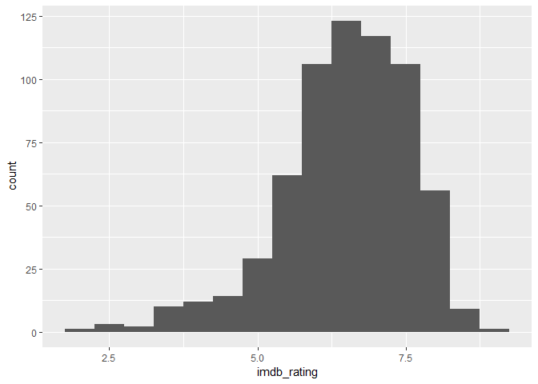

It is clear that the highest number of movies have the **IMDB Rating** somewhere around 6.5. The distribution is left skewded, meaning that the people tend to avoid giving very low ratings to movies (that is why there is very low number of movies with ratings below 5).

 

 

Distribution of the **IMDB Vote Number** variable:

``` r
ggplot(data = movies, aes(x = imdb_num_votes)) + geom_histogram(binwidth = 20000)
```

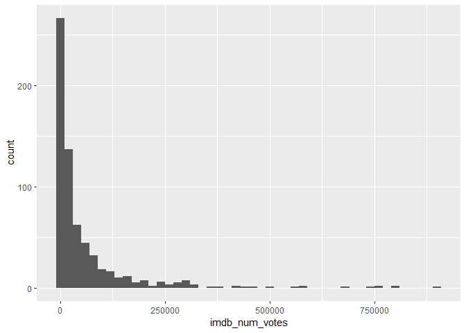

The distribution of the **Vote Number** is right skewed. This means that the majority of movies have lower number of votes (below 50 thousands) while only small share of movies have above 250 thousand votes.

 

 

Distribution of the **Runtime** variable:

``` r
ggplot(data = movies, aes(x = runtime)) + geom_histogram(binwidth = 10, na.rm = TRUE)
```

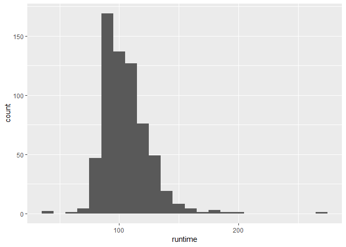

**Runtime** is a bit right skewed, which is self explanatory (almost all of the movies last longer than ~45 minutes). The majority of the movies last for about 90 minutes.

 

 

Distribution of the **Genre** variable:

``` r
ggplot(data = movies, aes(x = genre)) + geom_bar() + coord_flip()
```

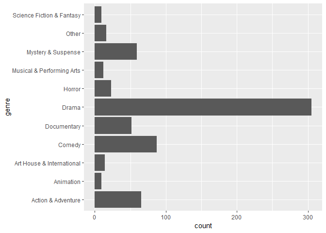

The **drama** genre accounts for the biggest share of all movies. It is followed by **comedy**, **action & adventure** and **mistery & suspense**.

 

 

Number of movies from the dataset, made by each **director** inside in the dataset:

``` r
movies %>%
  group_by (director) %>%
  summarise (count = n() ) %>%
  arrange (desc(count))
```

    ## # A tibble: 533 x 2
    ##    director        count
    ##    <chr>           <int>
    ##  1 James Ivory         4
    ##  2 Martin Scorsese     4
    ##  3 Oliver Stone        4
    ##  4 Renny Harlin        4
    ##  5 Woody Allen         4
    ##  6 Antoine Fuqua       3
    ##  7 Brian DePalma       3
    ##  8 Dennis Dugan        3
    ##  9 Howard Zieff        3
    ## 10 John McTiernan      3
    ## # ... with 523 more rows

As this dataset is made by using random sampling, and several big name directors can be seen at the top of the list above, one could argue that more successfull directors make more movies during their career (which is also logical in a way).

 

 

Distribution of the binary variable **"top 200 box"** (it is a top 200 earning movie or not):

``` r
movies %>%
  group_by (top200_box) %>%
  summarise(count = n(), share = n()/nrow(movies))
```

    ## # A tibble: 2 x 3
    ##   top200_box count  share
    ##   <fct>      <int>  <dbl>
    ## 1 no           636 0.977 
    ## 2 yes           15 0.0230

Around ~2% (15/636) of the movies from this dataset are in the **top 200 earners** category.

 

 

Distribution of the **Age Suitability Rating** variable :

``` r
movies %>%
  group_by (mpaa_rating) %>%
  summarise(count = n())
```

    ## # A tibble: 6 x 2
    ##   mpaa_rating count
    ##   <fct>       <int>
    ## 1 G              19
    ## 2 NC-17           2
    ## 3 PG            118
    ## 4 PG-13         133
    ## 5 R             329
    ## 6 Unrated        50

Only a small share of movies is intended for general public (**G** rating). Even smaller share of movies is prohibited to under 18 (**NC-17** rating). However, big share of the movies has been categorized as restricted (**R**) - no one under 18 is admitted to watch without a parent or a guardian.

 

 

Distribution of the **Theater Release Year** variable:

``` r
ggplot(data = movies, aes(x = thtr_rel_year)) + geom_bar() 
```

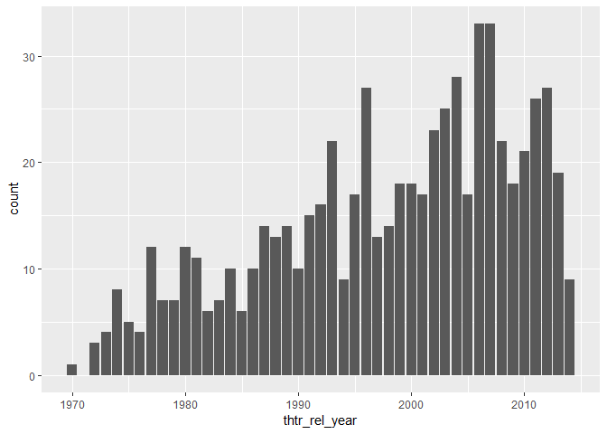

The **Theater Release Year** variable is left skewed which is expected in a way. As the movie industry has been growing, more movies have been published in the **recent years** than 20-30 years ago.

 

 

Distribution of the **Theatre Release Month** variable:

``` r
ggplot(data = movies, aes(x = thtr_rel_month)) + geom_bar()
```

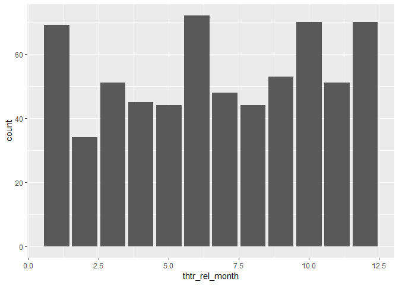

It is clear that the studios aim for releasing the movie in either **January** (Christmas and New Year holidays), **June** (before the summer vacation), **October** (after the summer vacation) or **December** (Christmas and New Year holidays).

 

 

Distribution of the **Theatre Release Day** variable:

``` r
ggplot(data = movies, aes(x = thtr_rel_day)) + geom_bar()
```

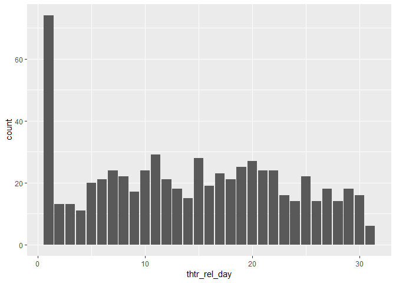

As well as aiming for specific months, the studios tend to release the movies on the **1st day of a month**. First guess for a reson would be that this date is more penetrative on an advertisement and it is increasing the desirability in the population to watch the movie.

 

------------------------------------------------------------------------

 

Part 4: Modeling
----------------

 

### **Choosing the variables for the model**

 

The variables that have been chosen for the regression model are:

-   **imdb\_rating** - The **Y** or the **dependent variable**. This is the variable that the developed model will be predicting. It is the average rating of a movie on the IMDB platform, in the range from 1 to 10.

 

-   **imdb\_num\_votes** - Numerical variable. Presents the number of people who voted for a movie. It can be seen as a proxy which represents how popular a particular movies is / was at the time.

-   **runtime** - Numerical variable. The lenght of a movie given in minutes. Even though insignificant (p-value = 0.13), it improved the adjusted *R*<sup>2</sup>.

-   **genre** - Categorical variable. The genre of a movie (drama, comedy, etc.).

-   **mpaa\_rating** - Categorical variable. The age suitability rating (for general public, for public above 18, etc.).

-   **best\_pic\_nom** - Binary variable. It tells if the movie was nominated for the *best picture academy award* or not.

-   **thtr** - Numerical variable. This is a newly created variable: **thtr** = thtr\_rel\_year - 1969 . It is basically a movie's release year, modified so that the 1970 (year of the oldest movie in the dataset) has a value of 1 and not such a huge number. It does not change anything regarding the model, except the coefficients for **Intercept** and **this variable** are **prettier**.

 

 

### **Intentionally omitted variables**

 

The variables that have not been even considered for the model:

-   **tittle** - Every entry is unique. Cannot provide anything useful to the model, at least not in the form of a full name because every name is unique (maybe some kind of a sentiment would provide something). However, if it is included in the model, the adjusted *R*<sup>2</sup> grows to 1 and it is a pure **case of overfitting**.

-   **tittle\_type** - Variable **genre** is already providing more valuable information of this kind to the model.

-   **critics rating**, **critics score**, **audience rating**, **audience score** - Provide the same type of information as the chosen **Y** (dependent variable), which is **imdb\_rating**. This is the information that is supposed to be predicted and it makes no sense to include these variables in the model as explanatory variables.

-   **imdb\_url**, **rt\_url** - No real information about a movie.

 

 

### **Excluded variables**

 

The variables that have been considered and tried, but in the end, have been excluded from the model:

-   **director** - Majority of the entries are unique. If this variable is included in the model, it results in the model overfitting (and the adjusted *R*<sup>2</sup> grows from the reference by ~0.3).

-   **studio** - Majority of the entries are unique. If this variable is included in the model, it results in the model overfitting (and the adjusted *R*<sup>2</sup> grows from the reference of by ~0.05).

 

-   **best\_pic\_win** - Proven to be insignificant and reduced the adjusted *R*<sup>2</sup>.

-   **best\_dir\_win** - Proven to be insignificant and reduced the adjusted *R*<sup>2</sup>.

-   **thtr\_rel\_month** - Proven to be insignificant and reduced the adjusted *R*<sup>2</sup>.

-   **thtr\_rel\_day** - Proven to be insignificant and reduced the adjusted *R*<sup>2</sup>.

-   **dvd\_rel\_year** - Proven to be insignificant and reduced the adjusted *R*<sup>2</sup>.

-   **dvd\_rel\_month** - Proven to be insignificant and reduced the adjusted *R*<sup>2</sup>.

-   **dvd\_rel\_day** - Proven to be insignificant and reduced the adjusted *R*<sup>2</sup>.

-   **thtr\_rel\_month\_categorical** - Mannually created variable to capture the release months which are targeted by publishing studios (January, June, October, December). Proven to be insignificant and reduced the adjusted *R*<sup>2</sup>.

-   **thtr\_rel\_day\_categorical** - Mannually created variable to capture the release days which are targeted by publishing studios (1st of a month). Proven to be insignificant and reduced the adjusted *R*<sup>2</sup>.

-   **best\_actor\_win**, **best\_actress\_win** - The variable shows if any of the five main actors/actresses ever got a **best\_actor\_win** (or actress win). It is not necessarilly given for the movie in a particular entry in the dataset. Proven to be insignificant and reduced the adjusted *R*<sup>2</sup>.

-   **top\_200\_box** - Proven to be insignificant and reduced the adjusted *R*<sup>2</sup>.

 

 

### **Filtering the dataset**

 

In ordet to achieve the following **requirements** for the Linear Regression: **linear relationship**, **residuals normality**, **constant variability** (the **independent residuals** requirement was satisfied) - the original dataset had to be filtered. If not filtered, all of the three mentioned tests fail, and the model is not valid. When trying to fix the issue, **removal of any of the variables that was included in the model was not helping**. Also **creating dummy variables for specific range of values to achieve offsetting** in specific cases was also **not helpful**. Therefore, the dataset had to be filtered (removal of some extreme values that strongly influenced the model).

The changes that have been done in filtering:

-   removal of entries with **runtime** values above 205 minutes and below 50 minutes

-   removal of entries with **imdb\_num\_votes** above 250 000

-   removal of entries with **imdb\_rating** below 5

-   removal of one NA entry from the **runtime** variable which would cause warnings later (not connected to the bad model diagnostics)

 

``` r
movies <- movies %>%
   filter (!is.na(runtime), runtime < 205, runtime > 50, imdb_num_votes < 250000, imdb_rating > 5)
```

All the analysis in the ***Chapter 4 - Modelling*** was done with filtering applied. The analysis in the ***Chapter 3 - Exploratory Data Analysis*** was, however, done without filtering because it would be wrong to apply the filtering before exploring the data.

 

 

### **The model selection method**

 

The method used for model selection was **forward selection with adjusted *R*<sup>2</sup>** as a criteria.

One could also use **backward selection**, but within a dataset with many variables (like in this case), forward selection is maybe a better choice for perserving the model in your head (in other words: creates less mess when thinking about the model).

In terms of selection criteria (adjusted *R*<sup>2</sup> vs. p-value), **p-value criteria** was not chosen because there are two categorical variables (**genre** and **mpaa\_rating**) with some categories/levels (all of them coded as dummy variables) that happen to be **insignificant**, while majority other categories/levels of the same categorical variable happen to be **significant**. Taking the categorical variable out of the model (as one is not allowed to take out just a specific level), is strongly decreasing the adjusted *R*<sup>2</sup> (the performance of the model). Therefore, the adjusted *R*<sup>2</sup> criteria was chosen, while having in mind that some dummy variables inside the model are not significant.

 

 

### **Checking for multicollinearity**

 

Checking collinearity for all the numeric variables: **runtime**, **imdb\_num\_votes** and **thtr\_rel\_year**:

``` r
ggpairs(movies, columns = c(4, 14, 7))
```

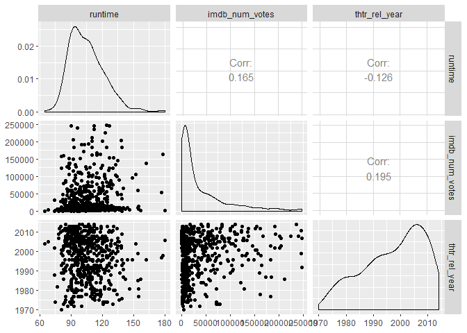

 

It is clear from the output that the **runtime** and **imdb\_num\_votes** variables are not correlated (0.165). Also, the **thtr\_rel\_year** variable is not correlated with any of the two other variables.

 

 

### **The Model**

 

Modifying the **thtr\_rel\_year** (just rescaling it by creating new variable):

``` r
movies <- movies %>% 
  mutate (thtr = thtr_rel_year - 1969)
```

 

 

Running the regression:

``` r
movie_model <- lm(imdb_rating ~ imdb_num_votes + runtime + genre + mpaa_rating  
                  + best_pic_nom + thtr,  data = movies)
```

 

 

Summary output of the model:

``` r
summary(movie_model)
```

    ## 
    ## Call:
    ## lm(formula = imdb_rating ~ imdb_num_votes + runtime + genre + 
    ##     mpaa_rating + best_pic_nom + thtr, data = movies)
    ## 
    ## Residuals:
    ##      Min       1Q   Median       3Q      Max 
    ## -1.61868 -0.40672 -0.01312  0.42304  1.82478 
    ## 
    ## Coefficients:
    ##                                  Estimate Std. Error t value Pr(>|t|)    
    ## (Intercept)                     6.405e+00  2.441e-01  26.243  < 2e-16 ***
    ## imdb_num_votes                  5.275e-06  5.531e-07   9.538  < 2e-16 ***
    ## runtime                         2.572e-03  1.696e-03   1.516 0.130015    
    ## genreAnimation                  1.217e-01  2.537e-01   0.480 0.631708    
    ## genreArt House & International  6.910e-01  1.911e-01   3.616 0.000327 ***
    ## genreComedy                     8.325e-02  1.147e-01   0.726 0.468277    
    ## genreDocumentary                1.539e+00  1.411e-01  10.909  < 2e-16 ***
    ## genreDrama                      5.375e-01  9.675e-02   5.555 4.37e-08 ***
    ## genreHorror                    -1.259e-01  1.622e-01  -0.776 0.438004    
    ## genreMusical & Performing Arts  1.160e+00  1.939e-01   5.979 4.10e-09 ***
    ## genreMystery & Suspense         3.256e-01  1.231e-01   2.645 0.008417 ** 
    ## genreOther                      2.550e-01  1.926e-01   1.324 0.186149    
    ## genreScience Fiction & Fantasy  1.683e-01  3.090e-01   0.545 0.586152    
    ## mpaa_ratingNC-17               -4.302e-01  4.493e-01  -0.958 0.338727    
    ## mpaa_ratingPG                  -4.309e-01  1.714e-01  -2.514 0.012235 *  
    ## mpaa_ratingPG-13               -6.277e-01  1.799e-01  -3.490 0.000523 ***
    ## mpaa_ratingR                   -3.928e-01  1.724e-01  -2.279 0.023073 *  
    ## mpaa_ratingUnrated              2.138e-02  2.027e-01   0.106 0.916012    
    ## best_pic_nomyes                 5.613e-01  1.655e-01   3.392 0.000746 ***
    ## thtr                           -1.147e-02  2.650e-03  -4.327 1.80e-05 ***
    ## ---
    ## Signif. codes:  0 '***' 0.001 '**' 0.01 '*' 0.05 '.' 0.1 ' ' 1
    ## 
    ## Residual standard error: 0.5888 on 537 degrees of freedom
    ## Multiple R-squared:  0.4371, Adjusted R-squared:  0.4172 
    ## F-statistic: 21.95 on 19 and 537 DF,  p-value: < 2.2e-16

 

The adjusted *R*<sup>2</sup> of the model is **0.4172**, which is the **highest achieved adjusted *R*<sup>2</sup>** without overfitting. This means that the model is able to explain 41.72% of the variability in the **IMDB Rating** (which is the **Y** variable).

None of the other variables were able to improve the adjusted R2 (without overfitting). Therefore, based on the given dataset, this is the optimal model for predicting the IMDB Rating variable.

 

### **Model Coefficients**

 

-   *Intercept*: **6.405**

With **all numerical variables beeing zero** (hypotetically) and all **categorical variables at their reference levels**, a movie would have a grade **6.405**. In other words, people start to rate movies from the grade **6.405** (this is not fully correct because some categorical *reference values* do not have the lowest coefficient for that variable and the numerical values inside the model cannot really be zero - but it is a fair similtude).

 

-   *imdb\_num\_votes*: **0.000 005 28**

With every additional vote, the IMDB rating rises by 0.000 003 61. In other words, **additional 1000 votes** would increase the IMDB Rating by **0.00528**.

 

-   *runtime*: **0.002 572**

With **every additional minute** in the movie lengt, the IMDB rating rises by **0.002**.

 

-   *genre*: **Action & Adventure** is the reference value with **0** gain

An **Action & Adventure** genre movie would gain **0** from this dummy variable in terms of IMDB Rating. All other levels/categories coefficients are calculated with the reference to Action & Adventure. For example, an **Animation** genre movie would gain **0.1217** for the IMDB Rating.

 

-   *mpaa\_rating*: **Intended for general public (G)** is the reference value with **0** gain

A **G** *age suitability* rating movie would gain **0** from this dummy variable in terms of IMDB Rating. All other levels/categories coefficients are calculated with the reference to Action & Adventure. For example, a movie with **R** suitability rating would gain **-0.3928** for the IMDB Rating (score would decrease by that).

 

-   *best\_pic\_nom*: **NO** is the reference value with **0** gain

A movie that has **not been nominated** for best picture award will gain **0** in terms of IMDB Rating (it is the reference). A movie that **was nominated** would gain **0.5613** for the IMDB Rating.

 

-   *thtr*: **-0.011 47**

With every additional year in terms of release date (e.g. year in future), the IMDB rating **decreases** by **0.011**. In other words, **additional 10 years** would decrease the IMDB Rating by **0.11**. This would mean that people tend to rate the **newer movies worse** than oldder movies, or that the quality of movie production decreases with time.

 

 

### **Model Diagnostics**

 

**(1)** Checking Linear relationship between explanatory and the explained variable:

``` r
plot1 = ggplot(data = movies, aes(x = runtime, y = imdb_rating)) + 
  geom_point() + 
  stat_smooth(method = "lm", se = TRUE)

plot2 = ggplot(data = movies, aes(x = imdb_num_votes, y = imdb_rating)) + 
  geom_point() + 
  stat_smooth(method = "lm", se = TRUE)

plot3 = ggplot(data = movies, aes(x = genre, y = imdb_rating)) + 
  geom_point() + 
  geom_jitter() +
  stat_smooth(method = "lm", se = TRUE)

plot4 = ggplot(data = movies, aes(x = mpaa_rating, y = imdb_rating)) + 
  geom_point() + 
  geom_jitter() +
  stat_smooth(method = "lm", se = TRUE)

plot5 = ggplot(data = movies, aes(x = best_pic_nom, y = imdb_rating)) + 
  geom_point() + 
  geom_jitter() +
  stat_smooth(method = "lm", se = TRUE)


plot6 = ggplot(data = movies, aes(x = thtr_rel_year, y = imdb_rating)) + 
  geom_point() + 
  geom_jitter() +
  stat_smooth(method = "lm", se = TRUE)

grid.arrange(plot1, plot2, plot3, plot4, plot5, plot6, nrow=2, ncol=3)
```

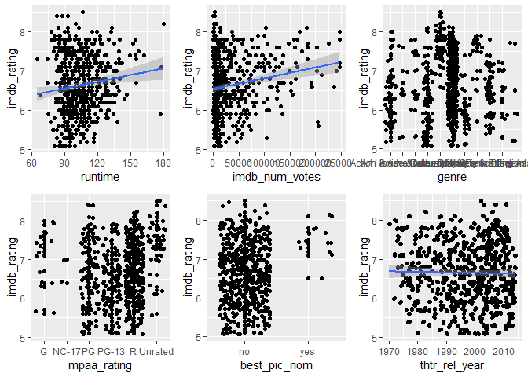

 

One can see that there is a some kind of linear relationship between the three numerical variables and the explained variable.

Categorical variables are plotted to have transparency on them also, and to get a sense of their association to the explained variable (even though they cannot have linear relationship with the Y variable as this is a property of numerical variables).

 

 

**(2)** Checking if the residuals are nearly normal with mean=0:

``` r
ggplot (data = movie_model, aes(x = movie_model$residuals)) + geom_histogram(binwidth = 0.25) +
  xlab ("Residuals") +
  ylab ("Count")
```

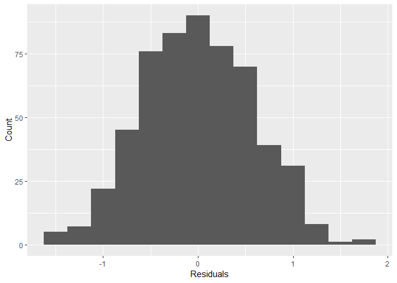

 

As it can be seen from the plot, residuals are nearly normal.

 

``` r
ggplot (data = movie_model, aes(sample = movie_model$residuals)) + geom_qq() + geom_qq_line()
```

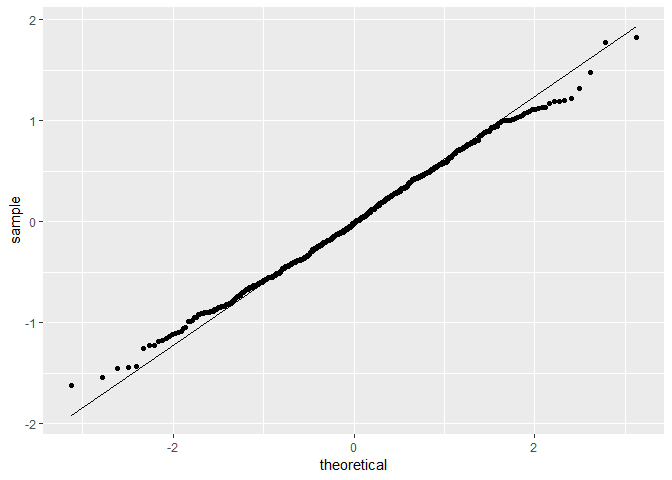

 

The normal probability plot of the residuals tells of course the same thing as the histogram above.

 

 

**(3)** Checking for constant variability of residuals

``` r
ggplot (data = movie_model, aes(x = movie_model$fitted.values, y = movie_model$residuals)) +
    geom_point() +
    xlab ("Fitted Values") +
    ylab ("Residuals")
```

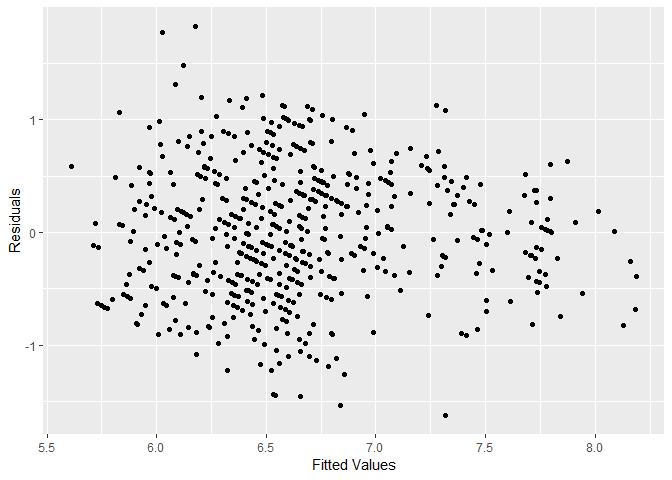

It can be said that there is a constant variability of the residuals, even though there are very light contours of the fan shape. It is important to say that without additional filtering on the dataset, the fan shape of residuals plot was extremely notable, and the filtering (done in the subchapter few steps above) had to be done.

 

The same plot, only with the absolute value of residuals:

``` r
ggplot (data = movie_model, aes(x = movie_model$fitted.values, y = abs(movie_model$residuals))) +
  geom_point() +
  xlab ("Fitted Values") +
  ylab ("Residuals")
```

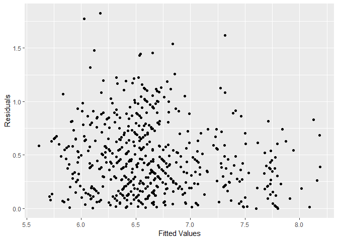

The plot says the same story as the one before - there is a constant variability of the residuals, even though there are very light contours of the fan shape.

 

 

**(4)** Checking for independent residuals:

``` r
ggplot (data = movie_model, aes( x = seq_along(movie_model$residuals), y =  movie_model$residuals)) +
    geom_point() +
    xlab ("Index") +
    ylab ("Residuals")
```

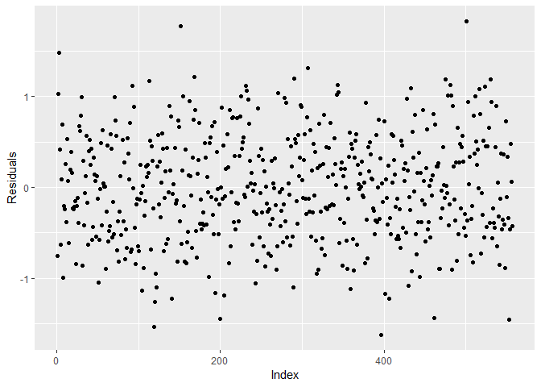

It is clear from the plot that the observations/residuals are independent (no relationship of residuals with index/sequence).

 

------------------------------------------------------------------------

 

Part 5: Prediction
------------------

 

The chosen movie for prediction is **The Magnificent Seven** (2016), which has the IMDB Rating of 6.4 .

The reference source for the information about the movie is the **IMDB**: <https://www.imdb.com/title/tt2404435/?ref_=adv_li_tt> .

As the model was made on the filtered dataset (runtime above 50 minutes and less than 205, number of votes less than 250 000), a prediction will be reliable only for the movies that satisfy these constraints. This is basically the majority (except very popular movies, which have high number of votes), and **The Magnificent Sevent** satisfies the constraints.

 

 

Creating the variable in R for the chosen movie:

``` r
new_movie <- data.frame (imdb_num_votes = 157088, runtime = 132, genre = "Action & Adventure",
                         mpaa_rating = "PG-13", best_pic_nom = "no", thtr = (2016-1969) )
```

 

 

Predicting the IMDB rating:

``` r
predict (object = movie_model, newdata = new_movie, interval = "prediction", level = 0.95)
```

    ##        fit      lwr      upr
    ## 1 6.406499 5.226911 7.586088

The predicted IMDB Rating is **6.4**. The real rating of the movie on IMDB is **6.9**.

The confidence interval of the prediction is CI (5.23 , 7.59). In other words, the model predicts with 95% confidence, that an **Action & Adventure** movie that was released in **2016**, is **132 minutes** long, has **157088 votes** on IMDB, is rated **PG-13** and **was not nominated** for the academy best picture award, is expected to have the IMDB rating between **5.23** and **7.59**.

 

------------------------------------------------------------------------

 

Part 6: Conclusion
------------------

 

### **Findings related to research question**

 

The IMDB rating can be explained by: nummber of votes, runtime, theater release year, genre, age suitability rating and the best picture nominee.

In terms of the numerical variables: **higher number of votes** and **more minutes** means a **higher grade**. **Older** the movie, **higher** the grade.

Movies with the **best picture nominee**, all else equal, get **better** ratings.

Regarding the **genre**, all else equal, **documentaries** tend to be rated best. They are followed by **music & performing arts** movies.

In terms of **age suitability rating**, movies rated for **general** audience have the highest rating, all else equal. There is no clear pattern with other ratings.

Some variables which were expected to be good determinants of the IMDB rating, like the **academy award for best picture** and **the best director academy award**, proved to be **insignificant**.

 

### **Findings related to data**

 

It is hard to satisfy all four **linear regression requirements** (model diagnostics). One cannot put any kind of data, run the regression and expect great results just like that. The **model diagnostics** has to be **conducted carefully** and perhaps (like in this case) do regression only on reduced dataset in order to have **reliable estimates**.

Even the variableS that **make the most logical sense**, **can prove** to be **insignificant** and reduce the adjusted *R*<sup>2</sup>.

Categorical variables that are **not really categorical**, but unique **identifiers**, must not be included in the model. They basically **cause overfitting**, even though they are **artificially improving** the adjusted *R*<sup>2</sup>.

Finding the **optimal model** is **quite demanding**. If there are many variables in the dataset, it takes a lot of time to test all of them and find the best model.

 

### **Shortcomings**

 

Unfortunately, it was **impossible** to create a model with **reliable estimates on the full dataset** (filtering had to be done).

In terms of **additional research** that could be done, **estimation of the movie gross box** would be really interesting and quite usefull for anyone in the movie industry.

 

------------------------------------------------------------------------

------------------------------------------------------------------------
